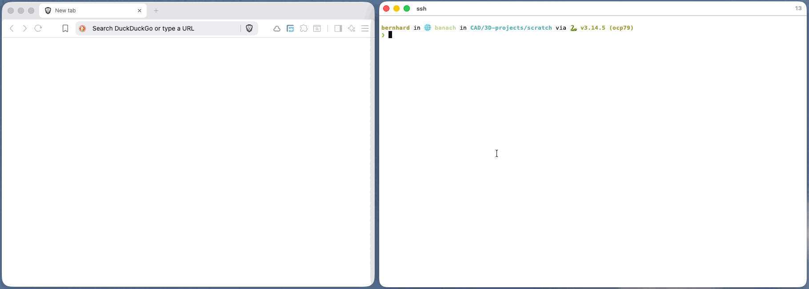

# Editor support

OCP CAD Viewer is most commonly used from VS Code, but it works with any editor that can run Python and reach the viewer over its local port.

## NeoVim

This chapter walks through setting up **NeoVim** as a full CAD workstation:

- a Python REPL to send code to
- a file tree
- LSP completion
- visual debugging that mirrors the VS Code experience by pushing every CAD object in `locals()` to the viewer on each debugger step.



The configuration below is built up plugin by plugin. By the end you will have a NeoVim config directory that you can extend further. All snippets together are equivalent to running a single bootstrap script, but going through them one at a time makes it clear what each piece does.

The setup is identical on **macOS, Linux and Windows** — only the config directory location and the install commands for the external tools differ. Those differences are called out below.

**Where NeoVim looks for its config.** NeoVim reads `init.lua` from its standard config directory. Throughout this page that directory is written as `~/.config/nvim`; substitute your platform's location:

| Platform      | Config directory      |
| ------------- | --------------------- |
| macOS / Linux | `~/.config/nvim`      |
| Windows       | `%LOCALAPPDATA%\nvim` |

On Windows the same `init.lua` / `lua/...` layout applies, just under `%LOCALAPPDATA%\nvim` (i.e. `%USERPROFILE%\AppData\Local\nvim`). You can always confirm the path from inside NeoVim with `:echo stdpath("config")`.

## Typical workflow

Once the configuration described below is in place, a typical editing session looks like this. The keys in parentheses are the mappings set up in the following sections.

1. **Activate your Python environment** — the one that has `ocp_vscode` (and `build123d`/`cadquery`, plus `debugpy` for visual debugging) installed.
2. **Launch NeoVim** in your project, either on a directory (`nvim .`) or directly on a file (`nvim file.py`).
3. **Pick a file** — if you opened with `nvim .`, focus the file tree (`<F1>`), move the cursor to the file and press `<Enter>` (or just click it). See [File tree](#file-tree).
4. **Start the viewer:**
    - a. In NeoVim, press `<Esc>` then `,vs` to start it in a bottom terminal split. See [Starting the viewer from NeoVim](#starting-the-viewer-from-neovim).
    - b. Open it in your browser using the URL printed in that terminal (e.g. `http://127.0.0.1:3939`; over SSH use `http://localhost:3939` through your [port-forward](#starting-the-viewer-from-neovim)).
5. **Edit your file.** If you want to work cell-by-cell through the Python REPL, mark cells with `# %%`.
6. **Run your code:**
    - a. _REPL:_ put the cursor in a cell and press `<F4>` to send it to the REPL and advance to the next cell (the REPL opens on first use). See [Iron REPL](#iron-repl--sending-code-to-python).
    - b. _Debugger:_ save with `<Esc>` then `:w`, then press `<F5>` and choose option `1` to run the current file. Set breakpoints with `<F8>` to inspect CAD objects at each step. See [Visual Debugging Support](#visual-debugging-support).

## Viewer

The viewer itself runs separately. Start it in [standalone mode](standalone.md) (`python -m ocp_vscode`) or inside VS Code, then point your `show*` / `show_all` calls at its port. NeoVim only needs to send Python to a REPL and, for debugging, evaluate an expression in the paused frame.

### Starting the viewer from NeoVim

The viewer is a long-running server, so it must be started in a way that does **not** block the editor:

- **Do not use `:!python -m ocp_vscode`** — `:!` runs synchronously and freezes NeoVim until the process exits, which for a server never happens.
- **Use a terminal buffer** instead, which keeps the server alive in its own window while you switch back to your code:

    ```vim
    :botright 4split | terminal python -m ocp_vscode
    ```

    Press `<C-\><C-n>` to leave terminal-insert mode and `<C-w>w` to jump back to your file. Closing the buffer (`:bd!`) stops the server.

- **Or run it as a detached background job** (no visible window):

    ```vim
    :lua vim.fn.jobstart({ "python", "-m", "ocp_vscode" }, { detach = true })
    ```

> [!WARNING]
> **Which Python?** `:terminal` and `jobstart` inherit NeoVim's environment, **not** the venv your REPL/debugger uses. The `python` they run must be the interpreter that has `ocp_vscode` installed. Either launch `nvim` from an already-activated environment, or give the full path, e.g. `terminal /path/to/venv/bin/python -m ocp_vscode`.

For convenience, this is bound to `,vs` in the base init.lua (see [Base settings](#base-settings)); it uses the leader key defined there.

**Remote (SSH) viewing.** The viewer binds to `127.0.0.1`, which is unreachable from your local machine when NeoVim runs on a remote host. Rather than exposing the server to the network with `--host`, forward the port over your SSH connection:

```bash
ssh -L 3939:localhost:3939 user@host
```

Then start the viewer normally (it stays on `127.0.0.1`) and open `http://localhost:3939` in your **local** browser — the connection is tunnelled through SSH, so nothing is exposed beyond your machine.

> [!NOTE]
> **`channel N: open failed: connect failed: Connection refused`** — if the SSH session prints this repeatedly, it is **harmless**. It means the tunnel is up but nothing is listening on `localhost:3939` on the remote — typically because you stopped the viewer (e.g. with `Ctrl-C`) while a browser tab is still open and auto-reconnecting to it. Close that browser tab, or restart the viewer so the port has a listener again. To silence the messages, connect with `ssh -o LogLevel=ERROR -L 3939:localhost:3939 user@host`.

**Key mapping:**

- `,vs` — start the OCP CAD Viewer in a bottom terminal split

## Prerequisites

- **NeoVim ≥ 0.11** (`nvim --version`). The config uses `vim.uv` and modern Lua APIs; older NeoVim versions will not work.

- **Git**: `git` on your `PATH` — the plugin manager clones itself and every plugin with it.

- **[lazy.nvim](https://github.com/folke/lazy.nvim)** is used as the plugin manager (other plugin managers might also work).
  Note: You do **not** install it by hand: the `lua/config/lazy.lua` snippet below bootstraps (git-clones) it on first launch and keeps it updated. It is listed here as a prerequisite because everything else in this guide is expressed as lazy.nvim plugin specs.

    _Why lazy.nvim?_ It is declarative (one Lua file per plugin, no imperative install steps), lazy-loads plugins so startup stays fast, auto-installs anything missing on first launch, and pins exact plugin versions in a `lazy-lock.json` lockfile — the same supply-chain hygiene you'd want from any package manager. Updates and a health overview are one `:Lazy` away.

- **Python**: Ensure **debugpy** is installed in your Python environment if you plan to use visual debugging

- **Mouse support:** NeoVim's mouse mode is enabled in `init.lua` below, but your terminal must forward mouse events. On macOS with iTerm2, turn **mouse reporting on**. Most Linux terminals (GNOME Terminal, Konsole, Alacritty, kitty, WezTerm) and Windows Terminal forward mouse events by default.

## Base installation

The sections below configure an opinionated set of key mappings. Feel free to cahnge to your own liking.

### External tool installation

Install the external command-line tools **before** starting NeoVim for the first time, so the plugins can build themselves on first launch.

- **macOS (Homebrew):**

    ```bash
    brew install neovim git tree-sitter-cli ripgrep
    ```

- **Linux:**

    ```bash
    # Debian / Ubuntu
    sudo apt install neovim git ripgrep
    # tree-sitter CLI (not packaged everywhere): via npm or cargo
    npm install -g tree-sitter-cli      # or: cargo install tree-sitter-cli

    # Fedora
    sudo dnf install neovim git ripgrep

    # Arch
    sudo pacman -S neovim git ripgrep tree-sitter-cli
    ```

- **Windows:**

    Use for example [Scoop](https://scoop.sh/) or [Chocolatey](https://chocolatey.org/) in an administrative Powershell:

    ```powershell
    scoop install neovim git ripgrep tree-sitter
    # or
    choco install neovim git ripgrep
    ```

### Directory layout

The configuration follows the standard [lazy.nvim](https://github.com/folke/lazy.nvim) structure: a single `init.lua` plus one file per plugin under `lua/plugins/`. Create the folders first:

- **macOS / Linux:**

    ```bash
    mkdir -p ~/.config/nvim/lua/config
    mkdir -p ~/.config/nvim/lua/plugins

    touch ~/.config/nvim/init.lua \
          ~/.config/nvim/lua/config/lazy.lua \
          ~/.config/nvim/lua/plugins/ironRepl.lua \
          ~/.config/nvim/lua/plugins/neo-tree.lua \
          ~/.config/nvim/lua/plugins/nvim-dap-python.lua \
          ~/.config/nvim/lua/plugins/nvim-dap-ui.lua \
          ~/.config/nvim/lua/plugins/nvim-lspconfig.lua \
          ~/.config/nvim/lua/plugins/onedark.lua \
          ~/.config/nvim/lua/plugins/treesitter.lua
    ```

- **Windows (PowerShell):**

    ```powershell
    mkdir $env:LOCALAPPDATA\nvim\lua\config
    mkdir $env:LOCALAPPDATA\nvim\lua\plugins

    "init.lua",
    "lua\config\lazy.lua",
    "lua\plugins\ironRepl.lua",
    "lua\plugins\neo-tree.lua",
    "lua\plugins\nvim-dap-python.lua",
    "lua\plugins\nvim-dap-ui.lua",
    "lua\plugins\nvim-lspconfig.lua",
    "lua\plugins\onedark.lua",
    "lua\plugins\treesitter.lua" |
        ForEach-Object { New-Item -ItemType File -Force "$env:LOCALAPPDATA\nvim\$_" }
    ```

When you are done the config directory looks like this (shown for macOS/Linux; the same layout lives under `%LOCALAPPDATA%\nvim` on Windows):

```
~/.config/nvim
├── init.lua
└── lua
    ├── config
    │   └── lazy.lua
    └── plugins
        ├── ironRepl.lua
        ├── neo-tree.lua
        ├── nvim-dap-python.lua
        ├── nvim-dap-ui.lua
        ├── nvim-lspconfig.lua
        ├── onedark.lua
        └── treesitter.lua
```

### Base settings

**Config file:** `init.lua`

`init.lua` sets a few editor options and then hands control to the plugin manager. Mouse support makes pane resizing and tree clicks work; the leader keys define the prefix for all the custom key bindings used below. The `,vs` mapping is a convenience for starting the viewer (see [Starting the viewer from NeoVim](#starting-the-viewer-from-neovim)); it must be defined **after** `mapleader` so `<leader>` expands to `,`.

```lua
-- ~/.config/nvim/init.lua
vim.opt.mouse = "a"
vim.g.mapleader = ","
vim.g.maplocalleader = " "

-- Start the OCP CAD Viewer in a bottom split (must be after mapleader is set)
vim.keymap.set("n", "<leader>vs", "<cmd>botright 4split | terminal python -m ocp_vscode<cr>",
  { desc = "Start OCP CAD Viewer" })

-- In a terminal window, press Esc to leave terminal-insert mode (see
-- "Moving between windows" below)
vim.keymap.set("t", "<Esc>", "<C-\\><C-n>", { desc = "Terminal: to normal mode" })

require("config.lazy")
```

**Key mappings:**

- `,` — leader key (the prefix for all the `,`-based mappings below)
- `<Space>` — local leader key
- `,vs` — start the OCP CAD Viewer in a bottom terminal split
- `<Esc>` _(in a terminal window)_ — leave terminal-insert mode

### Bootstrapping the plugin manager

**Config file:** `lua/config/lazy.lua`

This is the standard lazy.nvim bootstrap. On first launch it clones lazy.nvim into NeoVim's data directory and then loads every spec found under `lua/plugins/`.

```lua
-- ~/.config/nvim/lua/config/lazy.lua
-- Bootstrap lazy.nvim
local lazypath = vim.fn.stdpath("data") .. "/lazy/lazy.nvim"
if not (vim.uv or vim.loop).fs_stat(lazypath) then
  local lazyrepo = "https://github.com/folke/lazy.nvim.git"
  local out = vim.fn.system({ "git", "clone", "--filter=blob:none", "--branch=stable", lazyrepo, lazypath })
  if vim.v.shell_error ~= 0 then
    vim.api.nvim_echo({
      { "Failed to clone lazy.nvim:\n", "ErrorMsg" },
      { out, "WarningMsg" },
      { "\nPress any key to exit..." },
    }, true, {})
    vim.fn.getchar()
    os.exit(1)
  end
end
vim.opt.rtp:prepend(lazypath)

-- Setup lazy.nvim
require("lazy").setup({
  spec = {
    -- import your plugins
    { import = "plugins" },
  },
  -- colorscheme that will be used when installing plugins.
  install = { colorscheme = { "habamax" } },
  -- automatically check for plugin updates
  checker = { enabled = true },
  rocks = { enabled = false }
})
```

## Usability installations

These plugins make NeoVim comfortable to work in. None of them are CAD-specific, but they round out the environment around the REPL and debugger.

### Iron REPL — sending code to Python

**Config file:** `lua/plugins/ironRepl.lua`

You want to edit your preferred shell under `-- Pick the shell REPL based on the OS`

[Iron](https://github.com/Vigemus/iron.nvim) gives you an interactive Python REPL in a split and lets you send the current block, line, or selection to it. This is the everyday workflow for OCP CAD Viewer: keep `python` (or `ipython`) running, `show()` an object, edit, and re-send a block to update the viewer.

Note the **block dividers** `# %%` / `#%%` — split your script into cells with those markers and use `<F4>` to send a whole cell and advance to the next one.

```lua
-- ~/.config/nvim/lua/plugins/ironRepl.lua
return {
  'Vigemus/iron.nvim',
  config = function()
    local iron = require("iron.core")
    local view = require("iron.view")
    local common = require("iron.fts.common")

    -- Pick the shell REPL based on the OS
    local shell
    if vim.fn.has("win32") == 1 then
      shell = "powershell"  -- Windows
    elseif vim.fn.has("mac") == 1 then
      shell = "zsh"         -- macOS
    else
      shell = "bash"        -- Linux
    end

    iron.setup {
      config = {
        -- Whether a repl should be discarded or not
        scratch_repl = true,
        -- Your repl definitions come here
        repl_definition = {
          sh = {
            -- Shell REPL (optional); `shell` is set per-OS above
            command = { shell }
          },
          python = {
            command = { "python" },  -- or { "ipython", "--no-autoindent" }
            format = common.bracketed_paste_python,
            block_dividers = { "# %%", "#%%" },
          }
        },
        -- set the file type of the newly created repl to ft
        repl_filetype = function(bufnr, ft)
          return ft
        end,
        -- How the repl window will be displayed
        repl_open_cmd = view.split.botright("20%")
      },
      -- Iron doesn't set keymaps by default anymore.
      keymaps = {
        toggle_repl = "<leader>rr", -- toggles the repl open and closed.
        restart_repl = "<leader>rR", -- calls `IronRestart` to restart the repl
        send_motion = "<leader>sc",
        visual_send = "<leader>sc",
        send_file = "<leader>sf",
        send_line = "<leader>sl",
        send_paragraph = "<leader>sp",
        send_until_cursor = "<leader>su",
        send_mark = "<leader>sm",
        send_code_block = "<leader>sb",
        send_code_block_and_move = "<leader>sn",
        mark_motion = "<leader>mc",
        mark_visual = "<leader>mc",
        remove_mark = "<leader>md",
        cr = "<leader>s<cr>",
        interrupt = "<leader>s<leader>",
        exit = "<leader>sq",
        clear = "<leader>cl",
      },
      highlight = {
        italic = true
      },
      ignore_blank_lines = true, -- ignore blank lines when sending visual select lines
    }

    -- iron also has a list of commands, see :h iron-commands for all available commands
    vim.keymap.set('n', '<leader>rf', '<cmd>IronFocus<cr>')
    vim.keymap.set('n', '<leader>rh', '<cmd>IronHide<cr>')
    vim.keymap.set('n', '<F3>', '<cmd>IronRepl<cr>')
    vim.keymap.set('n', '<S-F3>', '<cmd>IronRestart<cr>')
    vim.keymap.set('n', '<F4>', function() require'iron.core'.send_code_block(true) end, { desc = 'Iron send block and move' })
    vim.keymap.set('n', '<S-F4>', function() require'iron.core'.send_code_block(false) end, { desc = 'Iron send block and stay' })
  end
}
```

**Key mappings:**

- `F3` — open the REPL
- `Shift+F3` — restart the REPL
- `F4` — send the current code block and move to the next one
- `Shift+F4` — send the current code block and stay
- `,rf` — focus the REPL window
- `,rh` — hide the REPL window
- `,rr` — toggle the REPL open/closed
- `,rR` — restart the REPL
- `,sc` — send motion / visual selection
- `,sf` — send the whole file
- `,sl` — send the current line
- `,sp` — send the current paragraph
- `,su` — send from start up to the cursor
- `,sb` — send the current code block
- `,sn` — send the current code block and move
- `,sm` — send to a mark
- `,mc` — mark motion / visual selection
- `,md` — remove a mark
- `,s<CR>` — send a carriage return to the REPL
- `,s,` — interrupt the REPL (Ctrl-C)
- `,sq` — exit the REPL
- `,cl` — clear the REPL

### File tree

**Config file:** `lua/plugins/neo-tree.lua`

[neo-tree](https://github.com/nvim-neo-tree/neo-tree.nvim) provides the file explorer, buffer list and git status view, all toggled from `<F1>`.

```lua
-- ~/.config/nvim/lua/plugins/neo-tree.lua
return {
  "nvim-neo-tree/neo-tree.nvim",
  branch = "v3.x",
  dependencies = {
    "nvim-lua/plenary.nvim",
    "MunifTanjim/nui.nvim",
    "nvim-tree/nvim-web-devicons", -- optional, but recommended
  },
  lazy = false, -- neo-tree will lazily load itself
  ---@module 'neo-tree'
  ---@type neotree.Config
  opts = {
    -- options go here
  },
  config = function ()
    require('neo-tree').setup({
      window = {
        mappings = {
          ['e'] = function() vim.api.nvim_exec('Neotree focus filesystem left', true) end,
          ['b'] = function() vim.api.nvim_exec('Neotree focus buffers left', true) end,
          ['g'] = function() vim.api.nvim_exec('Neotree focus git_status left', true) end,
          ['<F1>'] = function() vim.api.nvim_exec('Neotree close', true) end,
        },
      },
    })
    vim.keymap.set("n", "<F1>", "<cmd>Neotree focus<cr>", { desc = "Neotree Focus" })
  end
}
```

**Key mappings:**

- `F1` — focus the tree (from any window)
- `F1` _(inside the tree)_ — close the tree
- `e` _(inside the tree)_ — switch to the filesystem view
- `b` _(inside the tree)_ — switch to the buffers view
- `g` _(inside the tree)_ — switch to the git status view

### Syntax highlighting

**Config file:** `lua/plugins/treesitter.lua`

[nvim-treesitter](https://github.com/nvim-treesitter/nvim-treesitter) provides accurate syntax highlighting and the code-block detection Iron relies on. `:TSUpdate` runs on install (this is why the `tree-sitter-cli` prerequisite matters).

```lua
-- ~/.config/nvim/lua/plugins/treesitter.lua
return {
  {
    "nvim-treesitter/nvim-treesitter",
    branch = 'master',
    lazy = false,
    build = ":TSUpdate"
  }
}
```

### Language server & completion

**Config file:** `lua/plugins/nvim-lspconfig.lua`

[nvim-lspconfig](https://github.com/neovim/nvim-lspconfig) together with [mason](https://github.com/williamboman/mason.nvim) and [nvim-cmp](https://github.com/hrsh7th/nvim-cmp) gives you Python (`pyright`) completion, hover docs and go-to-definition — handy when exploring the build123d / CadQuery APIs.

```lua
-- ~/.config/nvim/lua/plugins/nvim-lspconfig.lua
return {
  "neovim/nvim-lspconfig",
  dependencies = {
    "williamboman/mason.nvim",
    "williamboman/mason-lspconfig.nvim",
    "hrsh7th/nvim-cmp",
    "hrsh7th/cmp-nvim-lsp",
    "L3MON4D3/LuaSnip",
    "saadparwaiz1/cmp_luasnip",
  },
  config = function()
    require("mason").setup()
    require("mason-lspconfig").setup({
      ensure_installed = { "pyright", "ts_ls" },
      -- You can also add more servers here
    })

    -- Neovim 0.11+ LSP API. Server configs ship with nvim-lspconfig as
    -- runtime `lsp/<name>.lua` files; we only add the completion capabilities
    -- (shared by every server) and then enable the servers we want.
    local capabilities = require("cmp_nvim_lsp").default_capabilities()
    vim.lsp.config("*", { capabilities = capabilities })
    -- Per-server overrides go via vim.lsp.config("pyright", { ... })
    vim.lsp.enable({ "pyright", "ts_ls" })

    local cmp = require("cmp")
    cmp.setup({
      mapping = cmp.mapping.preset.insert({
        -- preset.insert already maps <Up>/<Down> (and <C-p>/<C-n>) to move
        -- through the menu and <C-e> to dismiss it; we add <CR> to confirm.
        ["<CR>"] = cmp.mapping.confirm({ select = true }),
      }),
      sources = {
        { name = "nvim_lsp" },
        { name = "luasnip" },
        -- more sources as needed
      },
    })

    -- Buffer-local key mappings, set once a server attaches to a buffer
    vim.api.nvim_create_autocmd("LspAttach", {
      callback = function(args)
        local bufnr = args.buf
        vim.keymap.set("n", "gd", vim.lsp.buf.definition, { buffer = bufnr })
        vim.keymap.set("n", "K", vim.lsp.buf.hover, { buffer = bufnr })
        -- etc.
      end,
    })
  end
}
```

**Key mappings** (active in buffers with an attached language server):

- `gd` — go to definition
- `K` — show hover documentation

Completion menu (nvim-cmp, while the popup is open):

- `<Down>` / `<Up>` — move to the next / previous suggestion
- `<C-n>` / `<C-p>` — same as `<Down>` / `<Up>`
- `<Enter>` — confirm and insert the highlighted suggestion
- `<C-e>` — dismiss the menu

### Theme

**Config file:**`lua/plugins/onedark.lua`

[onedark](https://github.com/navarasu/onedark.nvim) provides a light/dark theme that toggles with `<F2>`.

```lua
-- ~/.config/nvim/lua/plugins/onedark.lua
return {
  {
    "navarasu/onedark.nvim",
    priority = 1000,          -- load before all other start plugins
    config = function()
      require('onedark').setup {
        style = 'light',       -- initial default, can be 'light', 'warmer', etc.
        toggle_style_key = "<F2>",  -- binds <F2> to toggle between styles
        toggle_style_list = { 'dark', 'light' }, -- specify which styles to toggle
      }
      require('onedark').load()     -- activates the theme
    end,
  },
}
```

**Key mappings:**

- `F2` — toggle between the light and dark style

## Moving between windows

With the file tree, editor and a terminal split open, you move between them with NeoVim's window (`<C-w>`) commands — hold `Ctrl`, press `w`, then a direction:

- `<C-w>h` / `<C-w>j` / `<C-w>k` / `<C-w>l` — move to the window left / down / up / right
- `<C-w>w` — cycle to the next window (`<C-w>W` cycles backwards)
- `<C-w>p` — jump to the previous (last-used) window

Your plugin bindings also jump straight to specific windows: `<F1>` focuses the file tree and `,rf` focuses the Iron REPL.

### Getting out of a terminal window

A `:terminal` buffer (e.g. the viewer started with `,vs`) opens in **terminal-insert mode**, where every keystroke — including `<C-w>` — is sent to the running process instead of NeoVim. So `<C-w>` does nothing until you first leave that mode:

- Press `<C-\><C-n>` (hold `Ctrl`, press `\`, then `n`) to drop into terminal-normal mode. The process keeps running.
- Or press `<Esc>` — the base [`init.lua`](#base-settings) maps it to the same thing (see below).

This only changes _mode_, it does **not** move you to another window — you are still in the terminal. To reach the editor, follow it with a window motion, e.g. `<C-w>k` (move up) or `<C-w>w` (cycle). So the full "get me back to my code" sequence is **`<Esc>` then `<C-w>k`**.

To type into the shell again, focus the terminal window and press `i` or `a`.

The `<Esc>` mapping that makes this less awkward:

```lua
-- press Esc to exit terminal-insert mode
vim.keymap.set("t", "<Esc>", "<C-\\><C-n>", { desc = "Terminal: to normal mode" })
```

> [!NOTE]
> This remaps `<Esc>` inside _every_ terminal buffer, so it is intercepted by NeoVim instead of reaching programs running in the terminal (a TUI, or `ipython` in vi-mode). For a terminal that only runs the viewer server that is harmless; remove the mapping if you run interactive programs that need `<Esc>`.

### Using the mouse

Because `vim.opt.mouse = "a"` is set in `init.lua`, you can also switch windows with the mouse:

- **Click** any window (tree, editor or terminal) to focus it — no `<C-\><C-n>` needed to leave the terminal this way.
- **Drag a window border** to resize.
- The scroll wheel scrolls the window under the pointer.

This requires your terminal emulator to forward mouse events (see the **Mouse support** note under [Prerequisites](#prerequisites)). Clicking into a terminal window focuses it but stays in normal mode — press `i`/`a` to type at the shell.

> [!TIP]
> **Over SSH:** the mouse is handled by your **local** terminal emulator, so it still works when you edit on a remote host — the clicks are forwarded down the SSH connection. Just make sure mouse reporting is enabled locally (in iTerm2: _Settings → Profiles → Terminal → "Enable mouse reporting"_, also reachable from _View → Enable Mouse Reporting_). If NeoVim runs inside **tmux** on the remote host, also add `set -g mouse on` to its `~/.tmux.conf`. With reporting on, hold **Option** (iTerm2) to do a local text selection instead of sending the click to NeoVim.

## Visual Debugging Support

This is the part that makes NeoVim a first-class OCP CAD Viewer client. Using the [Debug Adapter Protocol](https://github.com/mfussenegger/nvim-dap), every time the debugger stops on a line, NeoVim evaluates an expression in the paused frame that pushes **all CAD objects in `locals()`** to the viewer — the same behavior as [visual debugging in VS Code](debug.md), where objects appear in the viewer labeled with their variable names as you step.

The key line is the `evaluate` request:

```python
from ocp_vscode import show_all, get_port; show_all(locals(), port=get_port())
```

`get_port()` discovers the running viewer's port, and `show_all(locals())` renders every CAD object currently in scope. Because it runs on the `event_stopped` listener, it fires automatically on every step and breakpoint.

### DAP for Python

**Config file:** `lua/plugins/nvim-dap-python.lua`

```lua
-- ~/.config/nvim/lua/plugins/nvim-dap-python.lua
return {
  {
    "mfussenegger/nvim-dap-python",
    config = function()
      require("dap-python").setup("python")
      require("dapui").setup()

      --Configure DAP providers
      vim.g.loaded_perl_provider = 0
      vim.g.loaded_ruby_provider = 0

      local dap, dapui = require("dap"), require("dapui")

      dap.listeners.before.attach.dapui_config = function()
        dapui.open()
      end
      dap.listeners.before.launch.dapui_config = function()
        dapui.open()
      end
      dap.listeners.before.event_terminated.dapui_config = function()
        dapui.close()
      end
      dap.listeners.before.event_exited.dapui_config = function()
        dapui.close()
      end

      -- On every stop, push all CAD objects in the paused frame to the viewer
      dap.listeners.after.event_stopped['AutoShowAllLocals'] = function(session, body)
        if body and body.threadId then
          session:request('stackTrace', {
            threadId = body.threadId,
            startFrame = 0,
            levels = 1,
          }, function(err, response)
            if err then
              vim.notify('DAP stackTrace error: ' .. vim.inspect(err), vim.log.levels.ERROR)
              return
            end
            local frames = response and response.stackFrames
            if frames and frames[1] then
              local frameId = frames[1].id
              session:request('evaluate', {
                expression = 'from ocp_vscode import show_all, get_port; show_all(locals(), port=get_port())',
                frameId = frameId,
                context = 'repl',
              }, function(e, resp)
                if e then
                  vim.notify('DAP eval error: ' .. vim.inspect(e), vim.log.levels.ERROR)
                end
              end)
            else
              vim.notify("error:" .. vim.inspect(response), vim.log.levels.ERROR)
            end
          end)
        else
          vim.notify('No threadId in event_stopped body!', vim.log.levels.ERROR)
        end
      end

      vim.keymap.set("n", "<F5>", dap.continue, { desc = "Debug: Continue" })
      vim.keymap.set("n", "<F8>", dap.toggle_breakpoint, { desc = "Debug: Toggle Breakpoint" })
      vim.keymap.set("n", "<F7>", dap.step_over, { desc = "Debug: Step Over" })
      vim.keymap.set("n", "<F6>", dap.step_into, { desc = "Debug: Step Into" })
      vim.keymap.set('n', '<leader>dt', function() require'dap'.terminate() end, { desc = 'DAP Terminate' })
    end
  }
}
```

**Key mappings:**

- `F5` — continue
- `F8` — toggle breakpoint
- `F7` — step over
- `F6` — step into
- `,dt` — terminate the debug session

### DAP UI

**Config file:** `lua/plugins/nvim-dap-ui.lua`

[nvim-dap-ui](https://github.com/rcarriga/nvim-dap-ui) provides the scopes, watches and stack panels that open automatically when a debug session starts (wired up by the listeners above).

```lua
-- ~/.config/nvim/lua/plugins/nvim-dap-ui.lua
return {
  {
    "rcarriga/nvim-dap-ui",
    dependencies = {"mfussenegger/nvim-dap", "nvim-neotest/nvim-nio"},
  },
}
```

**Key mappings:** none (the panels open/close automatically with the debug session)

### Debugging workflow

1. Start the viewer ([standalone mode](standalone.md) or VS Code) so `get_port()` has something to connect to.
2. Open your script in NeoVim.
3. Toggle a breakpoint with `<F8>` and start the session with `<F5>`.
4. Step through with `<F7>` / `<F6>`. After each stop, the CAD objects in scope appear in the viewer, labeled with their variable names. Planes, locations and axes show too — name your build123d contexts so they get meaningful labels.
5. Terminate with `,dt`.

## Updates via Lazy

Run `:Lazy` to open lazy.nvim's management dialog — a floating window that is your single place to install, update and inspect every plugin in this guide.

The dialog opens on a status overview and has a row of single-key actions across the top. The ones you will use most:

- `I` — **Install** any plugins that are listed in `lua/plugins/` but not yet on disk (this also happens automatically on startup).
- `U` — **Update** all plugins to the latest commit allowed by their spec, then rewrite the `lazy-lock.json` lockfile to the new revisions.
- `S` — **Sync**: install + update + clean in one step, so the installed plugins exactly match your specs.
- `C` — **Clean**: remove plugins that are on disk but no longer referenced.
- `X` — **Restore**: roll every plugin back to the exact revisions pinned in `lazy-lock.json` (your undo button after a bad update).
- `L` — show the **Log** of recent commits pulled in by the last update.
- `H` — open **`:checkhealth`** for lazy.nvim.
- `?` — toggle the **help** pane listing every key.

A typical maintenance cycle is: open `:Lazy`, press `U` to update, skim the log, and — if something broke — press `X` to restore the previous lockfile state. Quit the dialog with `q`.

Because `checker = { enabled = true }` is set in `lua/config/lazy.lua`, lazy.nvim also checks for updates in the background and shows a small notification when plugins are out of date; `:Lazy` is where you then act on it. Commit your `lazy-lock.json` alongside the config to make the plugin set reproducible across machines.

## Key bindings reference

The key bindings are defined in the sections

| Key               | Area   | Action               |
| ----------------- | ------ | -------------------- |
| `,vs`             | Viewer | Start the viewer     |
| `C-\ C-n` / `Esc` | Window | Leave terminal mode  |
| `C-w` h/j/k/l     | Window | Move between windows |
| `F1`              | Tree   | Focus tree           |
| `F1` _(in tree)_  | Tree   | Close tree           |
| `e` _(in tree)_   | Tree   | Filesystem view      |
| `g` _(in tree)_   | Tree   | Git status view      |
| `b` _(in tree)_   | Tree   | Buffers view         |
| `F2`              | Theme  | Toggle light/dark    |
| `F3`              | REPL   | Open                 |
| `S-F3`            | REPL   | Restart              |
| `F4`              | REPL   | Send block and move  |
| `S-F4`            | REPL   | Send block and stay  |
| `,rf`             | REPL   | Focus                |
| `,rh`             | REPL   | Hide                 |
| `F5`              | Debug  | Continue             |
| `F8`              | Debug  | Toggle breakpoint    |
| `F7`              | Debug  | Step over            |
| `F6`              | Debug  | Step into            |
| `,dt`             | Debug  | Terminate            |

**First launch.** Start NeoVim once after creating the files; lazy.nvim installs all plugins and treesitter parsers, and mason installs the language servers. Restart NeoVim when it finishes.
